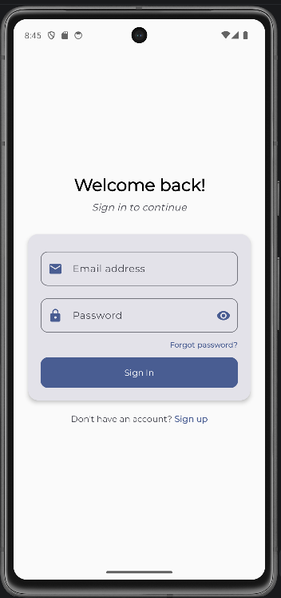
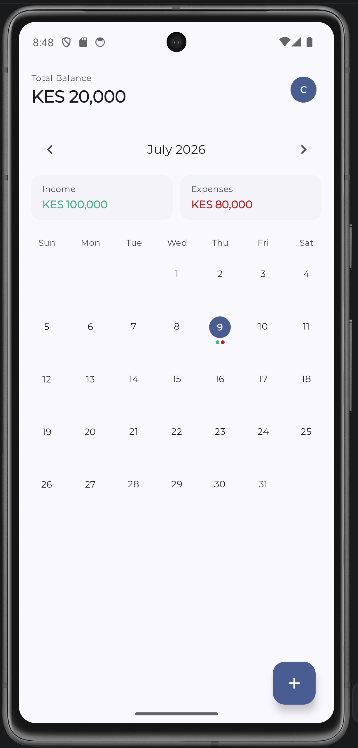
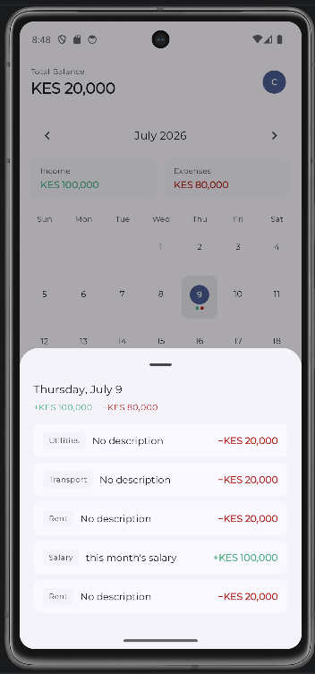
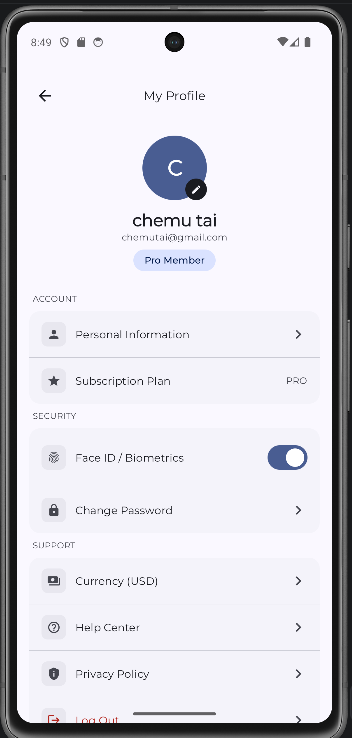

Penny is a Kotlin-based personal finance application that takes a calendar-first approach to managing your finances. Instead of the traditional transaction list view, Penny opens directly to a calendar interface, giving you a visual overview of your financial activities across time.
## Screenshots

  
  
  
  

